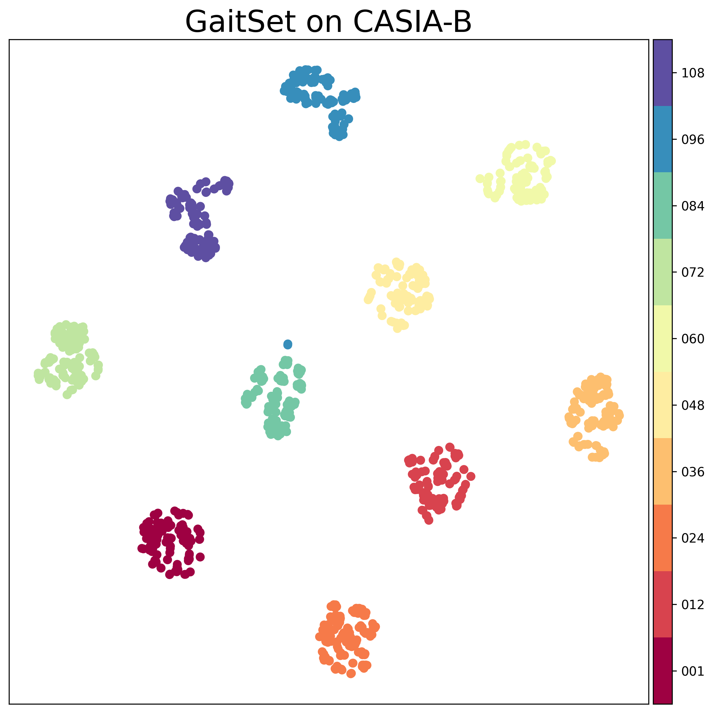
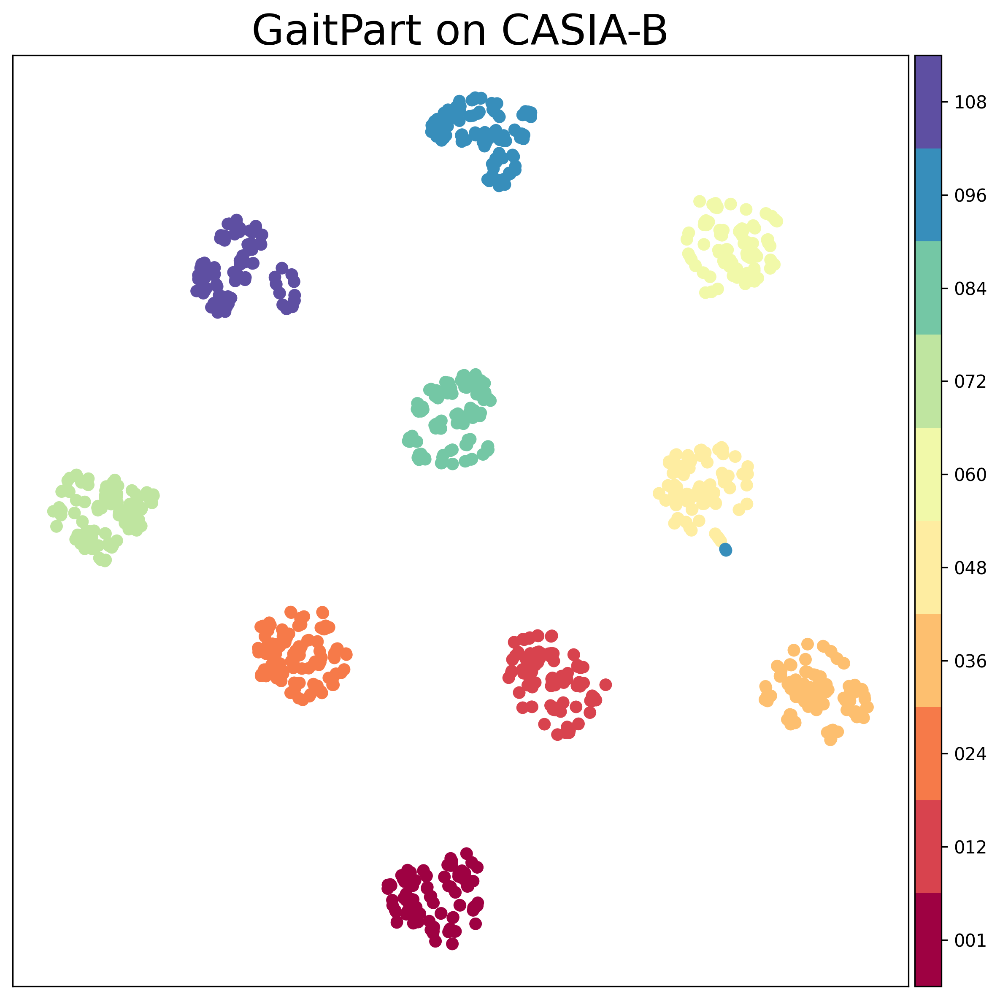
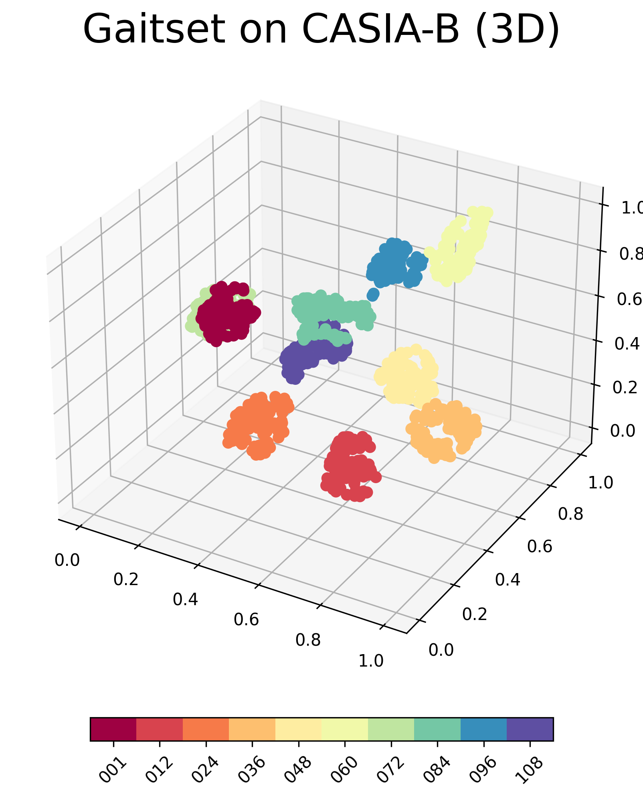
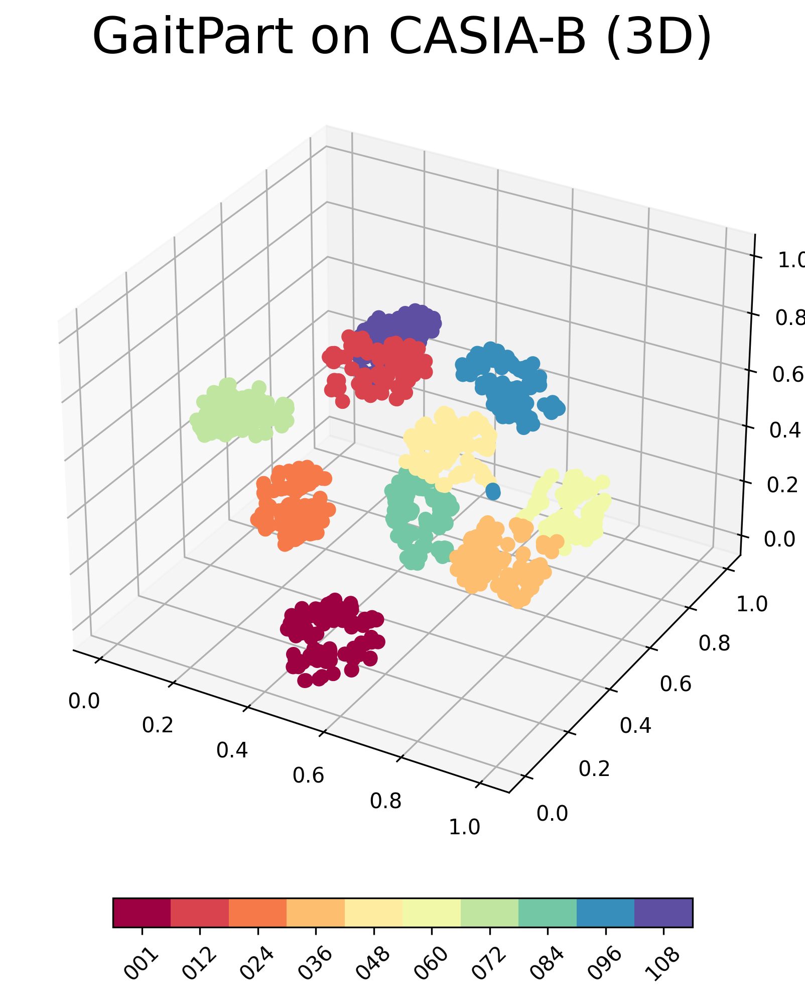
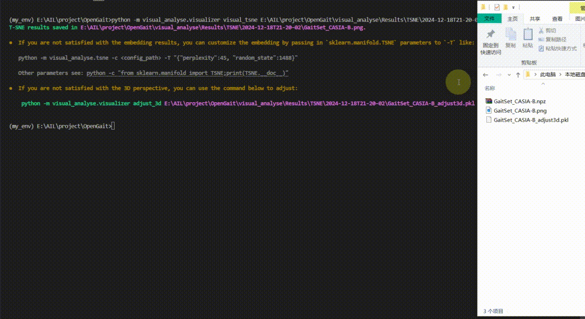

# 适于OpenGait框架的通用视觉分析工具 

- 在步态模型的评估方面，尽管[OpenGait](https://jgithub.xyz/ShiqiYu/OpenGait)提供了跨视角精度与跨域测试等方法，但在模型的**可解释性评估**上尚缺工具与手段。

- 为了更好地观察并比较模型在推理过程中的行为，本项目依托[OpenGait](https://jgithub.xyz/ShiqiYu/OpenGait)框架，提供了一些适用于`OpenGait`中所有模型的视觉分析工具，如梯度类激活图(`Grad-CAM`)、`t-SNE`等。

## ① Grad-CAM

<div align="center">

|                             Grad_CAM for GaitSet                             |                              Usage example                               |
|:----------------------------------------------------------------------------:|:------------------------------------------------------------------------:|
|  |  |

</div>

> [!NOTE]
> 你可能想知道的：
> <details>
> <summary>1. Grad-CAM 是什么</summary>
> 
> - 梯度类激活图(`Grad-CAM`)，由Zhou等人于2016年提出([论文](https://ieeexplore.ieee.org/document/7780688))，通过求解模型决策结果对指定含参层的梯度，并将梯度信息映射到输入图像上，从而可视化指定层对输入图像提取特征时的注意力分布
> 
> - `Grad-CAM`可用于解释指定层所提取的特征对最终决策结果的重要程度，从而帮助理解模型是如何做出决策的。
> 
> </details>
>
> <details>
> <summary>2. Grad-CAM 如何与 OpenGait 结合 </summary>
>
> - **以样本间最小欧式距离作为模型决策结果反求梯度**：`Grad-CAM` 一般适用于分类任务，此时模型输出(`logits`)常通过`softmax`函数转换为各类别的概率分布，则可用最大类别概率作为模型最终决策结果反求梯度。但步态识别是配准任务，给定一个`probe`样本，模型需要从`gallery`样本中找到与之最相似的样本，因此，我们对`probe`样本与`gallery`样本执行`OpenGait`提供的`cuda_dist`方法，并以最小距离作为模型决策结果反求梯度。
>
> - **单卡推理**：由于`Grad-CAM`的绘制通常仅需要针对少量样本完成步态模型的推理，而无需训练。因此，我们修改了数据读取与模型加载逻辑，去除了`OpenGait`中的`DDP`机制，防止分布式通信带来不必要的时间开销与实现复杂性。
>
> - **`hook` 机制**：`OpenGait` 中的模型继承于 `torch.nn.Module`，可通过在指定含参层注册前向传播与反向传播的`hook`函数，从而在推理过程中获取模型输出特征，在反向传播中获得该层梯度。
>
> - **时空特征自适应修复**：某些模型存在对空间维度的分割(如`gaitpart`的`FConv`、`gaitgl`的`GLFE`)以及时间维度的池化、卷积等操作(如`gaitset`的`set pooling`、`gaitgl`的`GLConv`等)，则经过处理的特征将在时空维度与原序列不对齐。我们通过识别特征份数与时序列长度，自动完成上述操作的反操作，以保证特征与序列的尽可能对齐，从而实现对这些特殊运算层的绘制。
> </details>
>
> <details>
> <summary>3. 所实现的 Grad-CAM 工具亮点 </summary>
>
> - **独立无干扰**：`Grad-CAM`的绘制仅需传入模型配置文件(`config.yaml`)路径即可，无需对配置文件进行改动，亦无需改动原始 `OpenGait` 的任何代码
>
> - **剪影模型通用**：适用于`OpenGait`中所有以剪影为输入的模型，后续将继续开发优化，以适配框架内所有模型。目前已成功测试了官方已提供权重的所有模型，包括 `gaitbase`、`gaitgl`、`gaitpart`、`gaitset`、`gln_p1`、`gln_p2`
>
> - **高的绘制自由度**：可针对任意多个含参层进行绘制，绘制结果将保存在指定目录中
>
> - **多样的绘制方式**：允许将多层 `Grad-CAM` 图单独保存为图片，或以子图方式绘制在一张图片(见上图👆)中用以对比分析。同时，支持图片尺寸缩放。
> </details>

### 步骤1：安装依赖

```bash
# pwd: .../OpenGait
conda activate <your-env-for-opengait>
pip install -r visual_analyse/requirements.txt
```

### 步骤2：准备数据

1. **对原始数据集进行预处理**：参考[OpenGait 数据集预处理文档](../docs/2.prepare_dataset.md)，以获得 `pkl` 格式的数据集

2. **准备训练好的模型**：参考[OpenGait 配置文件文档](../docs/3.detailed_config.md)完成配置文件设置，并根据[OpenGait 基本使用文档](../docs/0.get_started.md)，获得训练好的模型权重文件

3. **准备 `Probe` 样本**：将所要绘制 `Grad-CAM` 的样本放入 `Probes` 文件夹中，并按照训练模型所使用的数据集结构进行组织。如使用[`gaitbase_da_casiab.yaml`](../configs/gaitbase/gaitbase_da_casiab.yaml)，以`CASIA-B`练得的模型为例，则 `Probes` 文件夹结构如下：

    <details>
    <summary>Probes 目录结构示例</summary>

    ```plain-txt
    Probes/
    ├─ 001/
    │  ├─ nm-05/
    │  │  ├─ 000/
    │  │  │  └─ 000.pkl # 当然，你可以选择性地删除任何pkl
    │  │  ├─ 018/
    │  │  │  └─ 018.pkl
    │  │  ├─ 036/
    │  │  │  └─ 036.pkl
    │  │  ├─ 054/
    │  │  │  └─ 054.pkl
    │  │  ├─ 072/
    │  │  │  └─ 072.pkl
    │  │  ├─ 090/
    │  │  │  └─ 090.pkl
    │  │  ├─ 108/
    │  │  │  └─ 108.pkl
    │  │  ├─ 126/
    │  │  │  └─ 126.pkl
    │  │  ├─ 144/
    │  │  │  └─ 144.pkl
    │  │  ├─ 162/
    │  │  │  └─ 162.pkl
    │  │  └─ 180/
    │  │     └─ 180.pkl
    │  ├─ cl-01/
    │  │  └─ ...
    │  └─ bg-01/
    │     └─ ...
    ├─ 002/ 
    │  └─ ...
    └─ ...
    ```

    </details>


4. **准备 `Gallery` 样本**：将匹配样本放入 `Gallery` 文件夹中，并按照训练模型所使用的数据集结构进行组织。**你需要保证 `Gallery` 样本与 `Probe` 样本没有交集**❗ 如使用[`gaitbase_da_casiab.yaml`](../configs/gaitbase/gaitbase_da_casiab.yaml)，以`CASIA-B`练得的模型为例，则 `Gallery` 文件夹结构如下：

    <details>
    <summary>Gallery 目录结构示例</summary>

    ```plain-txt
    Probes/
    ├─ 001/
    │  ├─ nm-01/
    │  │  ├─ 000/
    │  │  │  └─ 000.pkl # 当然，你可以选择性地删除任何pkl
    │  │  ├─ 018/
    │  │  │  └─ 018.pkl
    │  │  ├─ 036/
    │  │  │  └─ 036.pkl
    │  │  ├─ 054/
    │  │  │  └─ 054.pkl
    │  │  ├─ 072/
    │  │  │  └─ 072.pkl
    │  │  ├─ 090/
    │  │  │  └─ 090.pkl
    │  │  ├─ 108/
    │  │  │  └─ 108.pkl
    │  │  ├─ 126/
    │  │  │  └─ 126.pkl
    │  │  ├─ 144/
    │  │  │  └─ 144.pkl
    │  │  ├─ 162/
    │  │  │  └─ 162.pkl
    │  │  └─ 180/
    │  │     └─ 180.pkl
    │  ├─ nm-02/
    │  │  └─ ...
    │  └─ nm-03/
    │     └─ ...
    ├─ 002/ 
    │  └─ ...
    └─ ...
    ```

    </details>

### 步骤3：绘制 Grad-CAM

1. 使用示例
    ```bash
    # pwd: .../OpenGait
    conda activate <your-env-for-opengait>

    ## save sequence images and heatmaps to npz file
    ## note that you will be prompted to pick layers you want to draw
    python -m visual_analyse.grad_cam -c <config_path>

    ## draw Grad-CAM according to the npz file
    python -m visual_analyse.visualizer visual_gradcam <path-to-npz-file> 
    ```

<details>
<summary>2. 参数说明</summary>

```bash
# python -m visual_analyse.grad_cam --help
# the optional args for `visual_analyse.grad_cam` will be showed:

optional arguments:
-h, --help            show this help message and exit
-c CONFIG_PATH, --config_path CONFIG_PATH
                        Path of the config file.
                        
-p PROBE_DIR, --probe_dir PROBE_DIR
                        Path of the probe data which will be analysed. Note that the structure of the dir should be the  
                        same as a dataset. Default: visual_analyse/Probes

-g GALLERY_DIR, --gallery_dir GALLERY_DIR
                        Path of the gallery data. Note that the structure of the dir should be the same as a dataset.    
                        Default: visual_analyse/Gallery

-s SAVE_DIR, --save_dir SAVE_DIR
                        Path to save the results. Default: visual_analyse/Results/Grad_CAM/<time>

--device DEVICE       GPU index to use. Default: 0
```

```bash
# python -m visual_analyse.visualizer visual_gradcam --help
# the optional args for `visual_analyse.visualizer.visual_gradcam` will be showed:

POSITIONAL ARGUMENTS
    NPZ_PATH
        Type: str
        path of a npz file or path of the directory containing npz files.

FLAGS
    -s, --save_dir=SAVE_DIR
        Type: Optional[typing.Optional[str]]
        Default: None
        path of a directory to save result images. When it's set to None, will be save to the same directory as the npz file with the npz file's name.Defaults to None.

    -h, --heatmap_opacity=HEATMAP_OPACITY
        Type: float
        Default: 0.6
        opacity of the heatmap. Defaults to 0.6.

    -d, --draw_mode=DRAW_MODE
        Type: str
        Default: 'merge'
        the mode to draw heatmap, can be 'merge', 'compare' or 'both'. When it's set to 'merge', will only save each heatmap as a separate image in the subdirectory with corresponding layer name. When it's set to 'compare', will draw origin image as well as all different layers' heatmaps in a figure. When it's set to 'both', will perform the behavior that 'merge' and 'compare' will do, respectively. Defaults to 'merge'.

    -r, --resize_ratio=RESIZE_RATIO
        Type: float
        Default: 1.0
        image resize ratio. Defaults to 1.0.

    -f, --font_scale=FONT_SCALE
        Type: float
        Default: 2.5
        font size scale ratio. This parameter only takes effect on 'compare' mode. Defaults to 2.5.
```

</details>

<details>
<summary>3. 附：各模型卷积层序号</summary>

|        模型        |           卷积层序号           |
|:------------------:|:------------------------------:|
|     `gaitbase`     |    1 5 8 10 13 17 20 24 27     |
|     `gaitset`      |   1 3 6 8 11 13 15 17 20 22    |
|     `gaitpart`     |         1 3 6 8 11 13          |
| `gln_p1`, `gln_p2` | 1 3 5 7 9 11 13 15 17 19 26 29 |
|      `gaitgl`      |       1 3 5 6 8 9 10 11        |

</details>

> [!WARNING]
> 1. **绘制结果随 `gallery` 样本集的不同而不同，是正常现象**：因为采用了`probe` 样本与多个 `gallery` 样本间的最小距离计算的梯度，因此 `gallery` 样本集的数据分布会影响最小距离的计算，进而影响梯度的计算，从而造成绘制结果不同。这是 `Grad-CAM` 应用于配准任务的正常现象，也符合直觉，毕竟 `probe` 样本与每个 `gallery` 样本匹配时，模型绝不可能完全关注到同一些区域。
>
> 2. **时间操作层可能导致帧数缩减，是正常现象**：对于执行时间维度操作的层，如果操作是时序池化(如`gaitset`的`set pooling`)，则各帧绘制结果一致，因为各帧已池化，属于正常现象；如果操作是时序卷积(`gaitgl`的`GLConv`中的`conv3d`)，则由于卷积造成的时序下采样，特征中时序维度与原始序列维度存在差异，此时为了对此层进行绘制，将对原始序列在时序维度模拟卷积下采样效果，即以滑动窗口方式进行GEI提取，以使层特征可绘制于时序下采样的序列上。
>
> 3. **`GaitEdge` 暂不可用**：以原图输入的端对端模型`GaitEdge` 由于在模型结构构建上调用了 `GaitGL` 的初始化，暂无法与本工具的单卡推理特性兼容。


## ② T-SNE

| GaitSet | GaitPart | GaitSet (3D) | GaitPart (3D) |
|:--:|:--:|:--:|:--:|
|  |  |  |  | 


> [!NOTE]
> 你可能想知道的：
>
> <details>
> <summary>1. T-SNE 是什么</summary>
>
> - T-分布随机邻域嵌入 (`T-SNE`, T-distributed Stochastic Neighbor Embedding) 由 `L.J.P. van der Maaten` 和 `G.E. Hinton` 于 2008 年在 [Visualizing High-Dimensional Data Using t-SNE](https://lvdmaaten.github.io/publications/papers/JMLR_2008.pdf) 中提出。其计算高维空间数据点的概率分布，并尝试在低维空间中寻找对应分布来拟合，从而达成使用低维分布替代高维完成降维的目的。
>
> - `T-SNE` 可用于对模型分类特征进行降维，通过可视化技术查看特征之间的关联性，从而判断模型提取的特征是否合理
>
> </details>
>
> <details>
> <summary>2. T-SNE 如何与 OpenGait 结合</summary>
> 
> - **捕获推理特征进行 T-SNE 降维**：捕获模型输出特征 (即 `retval['inference_feat']['embedding']`)，进行尺寸重塑与归一化后，调用 `sklearn.manifold.TSNE` 完成降维
> 
> </details>
>
> <details>
> <summary>3. 所实现的 T-SNE 工具亮点</summary>
>
> - **独立无干扰**：`T-SNE`的绘制仅需传入模型配置文件(`config.yaml`)路径即可，无需对配置文件进行改动，亦无需改动原始 `OpenGait` 的任何代码
>
> - **所有模型通用**：适用于 `OpenGait` 中的所有模型
>
> - **大规模数据下可行**：设置 `bucket_size` 参数，允许对大规模数据进行分批处理。该方法可能会导致绘制结果不准确，在分批数量达到一定阈值时会给予警告。
> 
> - **接受任意嵌入维度**：支持常见的二维或三维绘制。当嵌入维度为一维时，将通过零填充扩充至二维绘制；当嵌入维度大于三维时，将仅绘制前三维度。
>
> - **丰富而足够的自定义绘制参数**：允许自定义图题、图幅、散点尺寸、散点颜色、3D散点图视角、保存文件格式、保存背景透明与否。除此之外，接收原始 `sklearn.manifold.TSNE` 的所有参数，以适应不同的数据集情况，保证满意的绘制结果。
> 
> </details>

### 步骤1：安装依赖

```bash
# pwd: .../OpenGait
conda activate <your-env-for-opengait>
pip install -r visual_analyse/requirements.txt
```

### 步骤2：准备数据

1. **对原始数据集进行预处理**：参考[OpenGait 数据集预处理文档](../docs/2.prepare_dataset.md)，以获得 `pkl` 格式的数据集

2. **准备训练好的模型**：参考[OpenGait 配置文件文档](../docs/3.detailed_config.md)完成配置文件设置，并根据[OpenGait 基本使用文档](../docs/0.get_started.md)，获得训练好的模型权重文件

### 步骤3：绘制 T-SNE

1. 使用示例
    ```bash
    # pwd: .../OpenGait
    conda activate <your-env-for-opengait>

    ## save embedding features to npz file
    python -m visual_analyse.tsne -c <config_path>

    ## draw T-SNE according to the npz file
    python -m visual_analyse.visualizer visual_tsne <path-to-npz-file> 

    ## If you are not satisfied with the 3D perspective, 
    ## you can use the command below to adjust. 
    ## The <ax_pkl_path> is generated by the command above if embed_dim > 2 
    # python -m visual_analyse.visualizer adjust_3d <ax_pkl_path>
    ```

<details>
<summary>2. 参数说明</summary>

```bash
# python -m visual_analyse.tsne --help
# the optional args for `visual_analyse.tsne` will be showed:

optional arguments:
  -h, --help            show this help message and exit
  -c CONFIG_PATH, --config_path CONFIG_PATH
                        Path of the config file.
  -e EMBED_DIM, --embed_dim EMBED_DIM
                        Embedding dim of t-sne. Defaults to 2.
  -b BUCKET_SIZE, --bucket_size BUCKET_SIZE
                        Size of a bucket containing features to be performed t-sne. This argument is memory-friendly. Default: 20000
  -d DATASET_DIR, --dataset_dir DATASET_DIR
                        Path of the pkl dataset which will be analysed. Default: the value of `dataset_root` in config.
  -s SAVE_DIR, --save_dir SAVE_DIR
                        Path to save the results. Default: visual_analyse/Results/TSNE/<time>
  -T TSNE_ARGS, --TSNE_ARGS TSNE_ARGS
                        Used to receive customized TSNE drawing parameters. Defaults to {}.
  --verbose             Whether to print the progress while embedding. Defaults to False.
  --seed SEED           Random seed, used to reproduce the same embedding. Defaults to 1597.
  --device DEVICE       GPU index to use. Default: 0
```

```bash
# python -m visual_analyse.visualizer visual_tsne --help
# the optional args for `visual_analyse.visualizer.visual_tsne` will be showed:

POSITIONAL ARGUMENTS
    NPZ_PATH
        Type: str
	    path of a npz file or path of the directory containing npz files. Each npz file should contain:
        - `feats` (np.ndarray): embedded features with shape [SampleNum, FeatureDim]
        - `labels` (np.ndarray[str]): labels corresponding to the features, with shape [SampleNum] 

FLAGS
    --title=TITLE
        Type: Optional[typing.Optional[str]]
        Default: None
	    title of the plot.

    -f, --fig_size=FIG_SIZE
        Type: typing.Tuple[float, float]
        Default: (8.0, 8.0)
	    figure size in inches.

    -m, --marker_size=MARKER_SIZE
        Type: int
        Default: 50
	    size of the markers in the plot.

    -c, --cmap=CMAP
        Type: str
        Default: 'Spectral'
	    colormap.

    --transparent=TRANSPARENT
        Type: bool
        Default: True
	    whether to save transparent image.

    --save_path=SAVE_PATH
        Type: Optional[typing.Optional[str]]
        Default: None
	    path to save the result image. If it is set to None, will save the result image in the same directory as the input npz file.

    --save_ext=SAVE_EXT
        Type: str
        Default: 'png'
	    extension of the saved image, support [`.png`, `.jpg`, `.jpeg`, `.bmp`, `.tiff`, `.tif`, `svg`]
```
</details>

<details>
<summary>3. 三维图视角调整</summary>

- 如果嵌入维度大于2，将默认取前三维度绘制三维 T-SNE，并同步保存绘图对象(`matplotlib.axes._axes.Axes`) 于 `<model_name>_<dataset_name>_adjust3d.pkl` 文件中
- 若对保存的三维视角不满意，可使用下述命令进行调整、保存

    ```bash
    # pwd: .../OpenGait
    python -m visual_analyse.visualizer adjust_3d <adjust3d_pkl_path>
    ```

- 示例

     

</details>

## TODO

- [ ] 1. Grad-CAM 适配骨骼模型
- [x] ~~2. 实现 t-SNE~~
- [ ] 3. 优化大规模数据下 t-sne 内存占用问题
- [ ] 4. 优化多类别下 t-sne 图例显示
- [ ] 5. 实现 U-Map